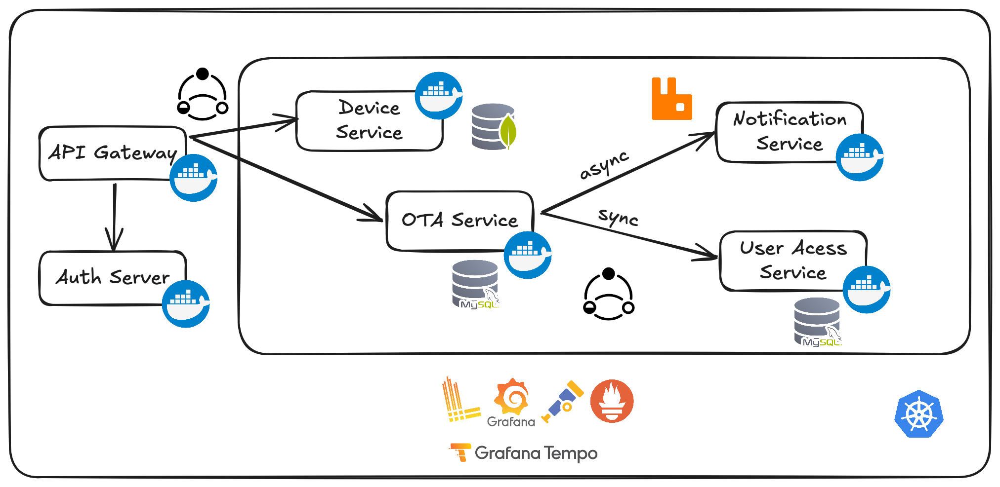

### **GRID-Sense IoT Manager**  
**A scalable OTA update system for Raspberry Pi fleets.**

---

### **Functional Requirements**  
#### **1. Device Management**  
- Auto-register devices (MQTT + MAC/UUID)  
- Real-time monitoring (heartbeats, CPU/memory)  
- Remote commands (reboot, reset)  

#### **2. OTA Updates**  
- Upload signed firmware (`.deb`, `.tar.gz`)  
- Target devices/groups + schedule updates  
- Atomic A/B updates with auto-rollback  

#### **3. Access Control**  
- RBAC: Admin, Operator, Viewer (Keycloak)  
- Audit logs for all actions  

#### **4. Alerting**  
- Email/SMS for failures (RabbitMQ async)  

---

### **Non-Functional Requirements**  
| Category       | Target                          | Tools               |  
|----------------|---------------------------------|---------------------|  
| **Performance**| 10K devices, 100+ concurrent OTAs| Prometheus, Grafana |  
| **Reliability**| 99.9% uptime                   | Kubernetes, MongoDB |  
| **Security**   | TLS 1.3, AES-256 encryption    | Keycloak, Vault     |  
| **Observability**| 2s dashboard updates          | Loki, Tempo         |  

---

### **Tech Stack**  
- **Backend**: Spring Boot (Java 21)  
- **Frontend**: React, tailwindcss
- **Databases**: MongoDB (devices), MySQL (OTA)  
- **Messaging**: MQTT (devices), RabbitMQ (alerts)  

---
### **Architecture**  

 